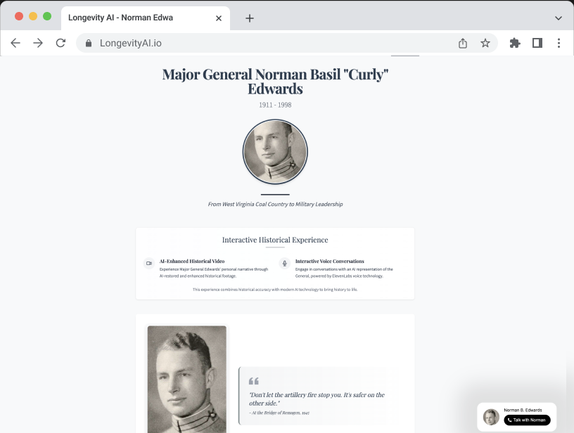

# Weeknotes: [November 19th]

_Weeknotes for Nov 

I try to publish weeknotes every Tuesday with what I've been working on, as well as interesting links, experiments, AI research and projects.

## Major accomplishments this week

# Longevity AI & Other Projects

I've been diving into several projects this week, primarily focusing on AI, digital nostalgia, and physical computing. A significant portion of my time has been dedicated to developing prototypes for the Mural Bot project, a collaboration with Joseph Kristofeltti, Tyler Hobbs, and Jon Starr.
You can also dive into more details on our project [here](https://github.com/hashbrown/mural-bot).
*Bonus, Here are a couple videos, [one from Joe's TedX talk](https://youtu.be/JjystPCYtv4?si=_kwA1Efb1VAE4kMZ) titled "What it’s Like to Use the City as Your Canvas" & and [one introducing Tyler Hobbs](https://youtu.be/5ETrXegVj_g?si=DKUBSAXtmaaQeboN) from Unit.
You can also dive into [Joe's website](https://josephkristofeltti.com/) and [Tyler's website](https://tylerxhobbs.com/) to learn more about their work. Both are amazing and worth checking out.

## Longevity AI

Recent conversations about AI have sparked interesting thoughts about its potential role in preserving digital culture and personal memories. The focus isn't on AI replacing human interaction, but rather on:

- Preserving memories of loved ones
- Creating digital legacies while people are still alive
- Enabling meaningful interactions with digital avatars of historical figures
- Building personal digital archives for future conversations

## Project progress

I've been using Elevenlabs for their voice cloning and custom voices. But a cool new feature called Conversational AI (in Beta) let me build a prototype using text files from web bios and some of his transcribed audio cassettes from when he wrote his memoir.

Elevenlabs allows you to create the intro your virtual agent will say, and then create a system prompt that will be "used to determine the persona of the agent and the context of the conversation."
Claude Wrote the intro and the system prompt and itwas quite a robust output. The other piece that was helpful to customize was the custom voice, which I had create from those audio cassette tapes once I cleaned up the audio a bit.
I customized a bio page using Huggingface Spaces and [served up a static html page](https://huggingface.co/spaces/hashbrown/Voice_Widgets) for my grandfather and embedded the widget from Elevenlabs that will initiate a call with the custom agent.

Go and check it out while I still have credits left on it:

*Bonus: I also created another agent based on [James Hollis](https://jameshollis.net/) and his work from books and lectures:

https://huggingface.co/spaces/hashbrown/Dr-James-Hollis-Demo

![[Web Browser Mockups Cover.png]]

## Interesting Links & Experiments
Great list of prompts for ChatGPT, definitely some banger in there, Spongebob's Magic Conch Shell prompt is a must try:
https://huggingface.co/datasets/fka/awesome-chatgpt-prompts

Facebook released their version of Llama 3, Notebook Llama Recipes, and it's available on Huggingface via the user yasserrmd:
https://huggingface.co/spaces/yasserrmd/NotebookLlama

Cursor, the AI-powered IDE, has launched a new competitor to GitHub Copilot called Codeium. It's an agentic IDE called Windsurf that uses AI to help you code:
https://www.codeium.com/

Chainforge is a new AI agent that allows you to build your own AI agents with no-code:
https://chainforge.ai/

Alex Ocheema, a product designer, shared a video of a new AI agent that can write code in Python:
https://x.com/alexocheema/status/1856239987982790685

I recently came across a fascinating article by [Simon Willison](https://simonwillison.net/2024/Oct/15/chatgpt-horoscopes/) about ChatGPT's memory features and personality insights. The article explores a viral prompt:

> From all of our interactions what is one thing that you can tell me about myself that I may not know about myself

While this prompt appears to provide deep personal insights, Simon explains that it's more akin to a sophisticated horoscope, leveraging ChatGPT's memory feature that OpenAI introduced in February and fully implemented in September. Pretty cool stuff.

Music and other conversations:
I've been recently digitizing  my uncle's Jazz CD collection and have been thinking about intention when listening to music. I had a great conversation with my friend and he mention Hailu Mergia's music and how it transports him to a different time and place. Thought this was a great example of intention and how music can transport you, so go check out this [Hailu Mergia CD bundle](https://awesometapes.com/shop/hailu-mergia-cd-bundle/)

Alright, hope you enjoyed this week's roundup. I'll see you next week with more interesting links, experiments, AI research and projects.

