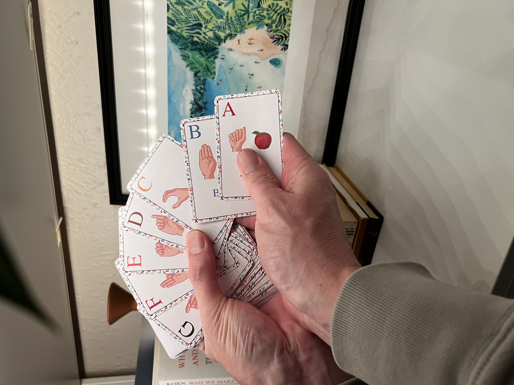
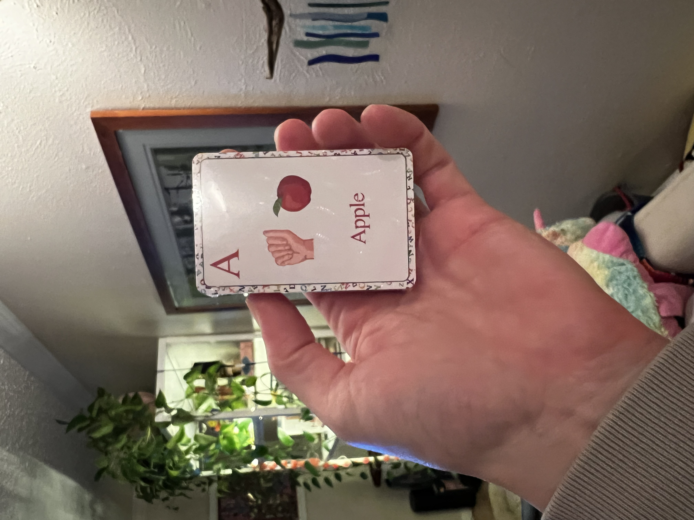
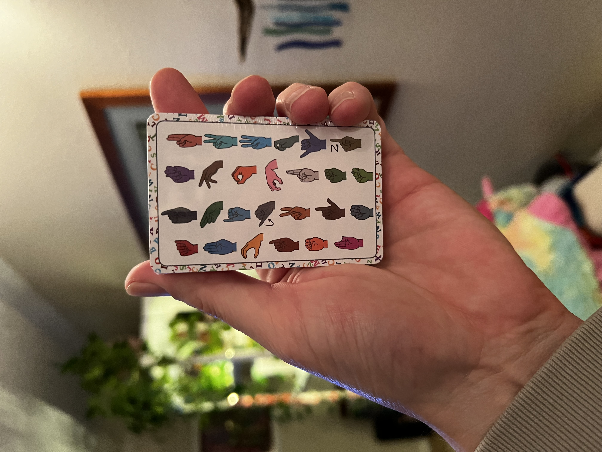

## Project Overview
This is a project that I started in 2024 to help teach ASL to those who are deaf or hard of hearing using visual elements to cue the letters and signs. It utilizes a deck of cards with visual cues to help teach the letters and signs. By using visual cues, it helps those who are deaf or hard of hearing to understand the letters and signs and learn to fingerspell.
This was a passion project of mine to help teach ASL to those who are deaf or hard of hearing. I created the project to help teach ASL to those who are deaf or hard of hearing. I created the project to help teach ASL to those who are deaf or hard of hearing. I created the project to help teach ASL to those who are deaf or hard of hearing.

## Impact
The project impacted the lives of those who are deaf or hard of hearing by providing a way to learn ASL. It provided a way to learn ASL for those who are deaf or hard of hearing. It provided a way to learn ASL for those who are deaf or hard of hearing. It provided a way to learn ASL for those who are deaf or hard of hearing. We're currently in the process of developing this project further and I am currently looking for communities and individuals who are interested in using the project to help teach ASL to those who are deaf or hard of hearing.

---

