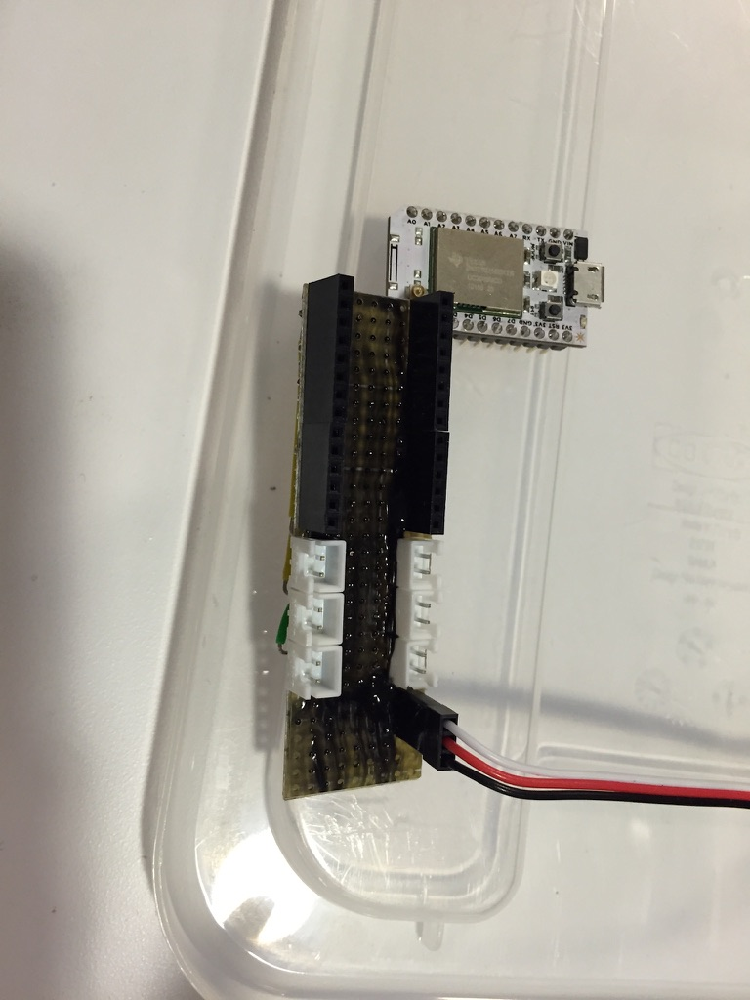
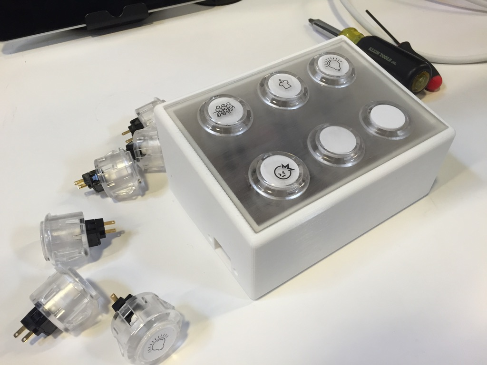
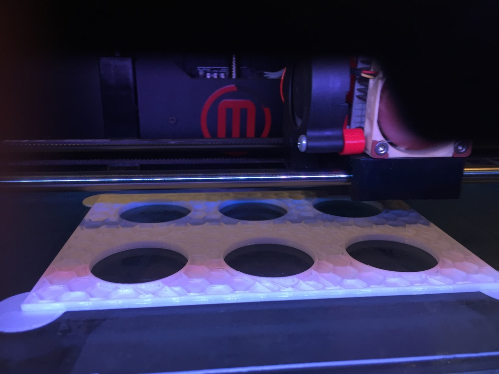
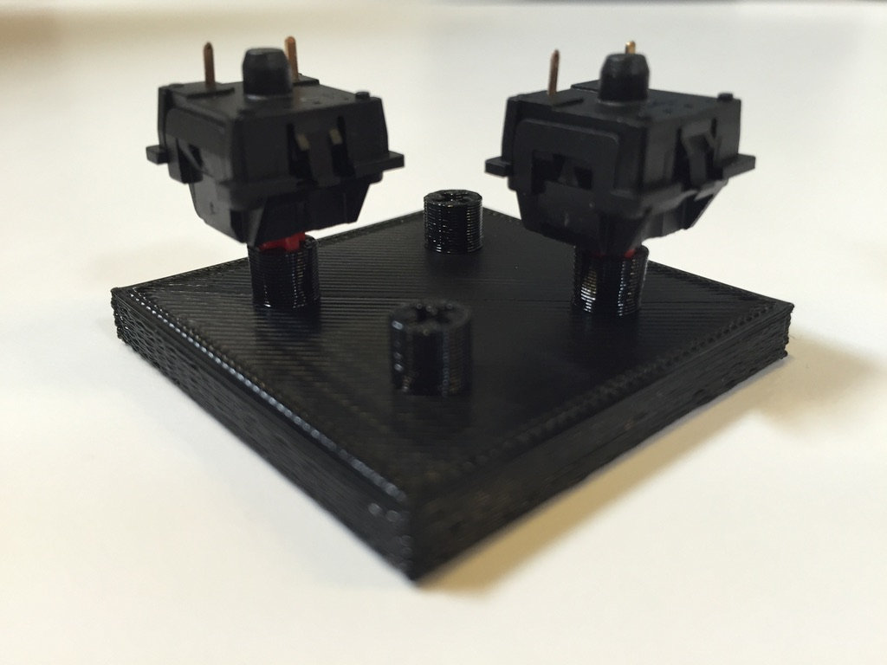

# Dustin's Words
**[GitHub Repository](https://github.com/dustins-words/Dustins-Words)**  
**[Project Website](https://dustins-words.github.io/Dustins-Words/index.html)**

https://github.com/dustins-words/Dustins-Words

### Open-Source Assistive Communication Device  
**Role**: Lead Developer  

**Technologies**: Arduino, Particle, Cloud Integration, IFTTT, Twilio  

**Focus Areas**: Assistive Technology, Communication Devices, Open Source  

## Project Overview  
Dustin's Words is an assistive communication device designed to help non-verbal individuals, particularly those with autism, communicate through text messaging. Originally built for my brother, the project has evolved into a scalable product powered by Particle. The device enables customizable communication with the push of a button, with open-source code and 3D models available for anyone to build and adapt.

## Key Contributions  
- **Device Development**: Designed and built the original device using Arduino, then transitioned to a scalable solution with Particle.
- **Customization**: Enabled customizable text messaging options via IFTTT and Twilio, providing flexibility for various communication needs.
- **Open Source**: Published the code and 3D models on GitHub and Thingiverse, allowing others to build and modify their own devices.
- **Crowdfunding**: Successfully launched an Indiegogo campaign to support further development and distribution of the device.

## Impact  
Dustin's Words provides an affordable, customizable communication tool for families dealing with disabilities, significantly reducing the costs associated with assistive technology. The open-source nature of the project ensures that it can be adapted to fit individual needs, making it a valuable resource for non-verbal individuals and their caregivers.

## Outcome  
This project demonstrates how open-source technologies can be leveraged to create meaningful solutions for individuals with disabilities. The device has garnered support through crowdfunding and community engagement, allowing it to be further developed and tested with a broader audience.

## Additional Involvement  
I continue to explore ways to improve and expand Dustin's Words, collaborating with the community to make communication more accessible for non-verbal individuals worldwide. The success of this project has opened doors for further innovations in assistive technology.

