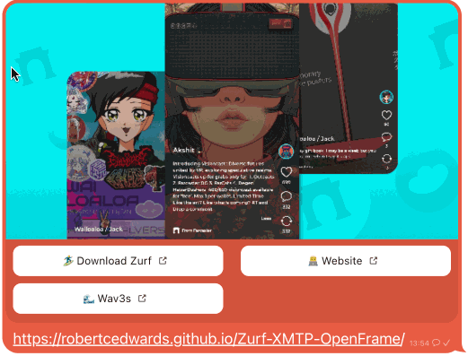

---

## **Demo Here 👇 & [Repos](#repos) Below ⬇️**

---
### Creating Dynamic Frames for XMTP and Warpcast  
**Role**: Developer, Contributor  

**Technologies**: XMTP API, Warpcast API, React, JavaScript, Frameworks  

**Focus Areas**: API Integration, Frontend Development, Framework Customization, Messaging Integration  

## Project Overview  
As part of an open bounty at Frameworks, I created a series of dynamic frames for XMTP and Warpcast. These frames are designed to integrate with messaging and social platforms, allowing users to showcase their profiles and other key details in a visually engaging way. The project involved building a portfolio frame that highlights user details and customizing the interaction between the XMTP and Warpcast APIs.

## Key Contributions  
- **API Integration**: Integrated XMTP and Warpcast APIs to create frames that pull in relevant user data, allowing for real-time updates within the frames.
- **Frontend Development**: Built user-friendly interfaces using React and JavaScript, ensuring the frames were both functional and visually appealing.
- **Framework Customization**: Customized the frames to match the unique needs of the XMTP and Warpcast ecosystems, focusing on seamless integration with existing platforms.
- **Portfolio Frame Development**: Created a portfolio frame that showcases user details in a clean and professional manner, adding value for users looking to present their profiles.

## Impact  
These frames provide a new way for users to interact with their data on XMTP and Warpcast, making it easier to present information and communicate across platforms. The frames enhance user experience by creating visually appealing and functional displays for personal and professional information.

## Outcome  
This project demonstrates how open frameworks can be leveraged to build custom solutions that integrate messaging and social data. The work on these frames highlights skills in API integration, frontend development, and user interface design, contributing to the broader goal of enhancing digital communication tools. These frames have also been featured on the [Awesome Open Frames](https://github.com/open-frames/awesome-open-frames?tab=readme-ov-file) resource page, which showcases notable contributions to the open frames community.

## Additional Involvement  
In addition to these frames, I continually explore opportunities to contribute to open-source projects, especially within the web3 and decentralized communication spaces. My work on these frames has opened up further possibilities for extending integration with other platforms and use cases.

## Repos
We'll need to load these into a dev tool like:
https://warpcast.com/~/developers/frames
or just paste the links into a Farcast or XMTP Client.

https://0xhashbrown.xyz

https://github.com/robertcedwards/farcaster-frame-bio

https://github.com/robertcedwards/Zurf-XMTP-OpenFrame/

