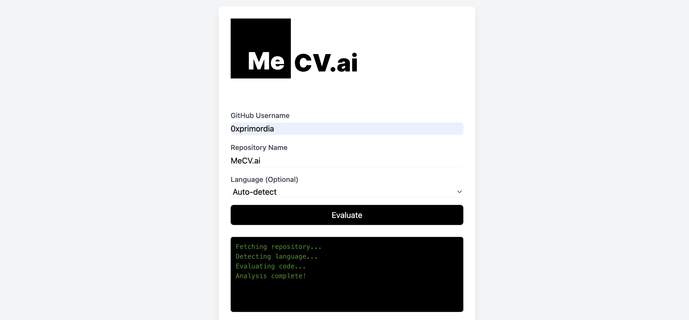

# MeCV.AI
https://mecvai-app.netlify.app/

**Role**: Project Lead, Prototype

**Technologies**: React, Tailwind, GitHub API, Netlify  

**Focus Areas**: Frontend Development, API Integration, Proficiency Evaluation, Blockchain Technology

## Project Overview
MeCV.AI is a cutting-edge platform designed to evaluate developer proficiency based on their GitHub activity. By leveraging the GitHub API, MeCV.AI analyzes the programming languages used in a developer’s repositories, providing insights into their expertise and experience levels. The platform is built with React and Tailwind, ensuring a sleek, responsive user interface, and is deployed on Netlify for seamless access and scalability.

## Key Contributions
- **Frontend Development**: Led the development of a user-friendly, responsive interface using React and Tailwind, ensuring an intuitive user experience.
- **API Integration**: Successfully integrated the GitHub API to fetch and analyze user data, enabling accurate assessments of programming proficiency.
- **Scalability and Deployment**: Deployed the platform on Netlify, ensuring high availability and performance for users across various devices.
- **Blockchain Integration**: Explored potential blockchain applications to enhance the security and verifiability of user credentials, aligning with the platform’s goal of providing trustworthy evaluations.

## Impact
MeCV.AI provides a unique solution for developers and recruiters alike, offering a reliable and data-driven way to assess coding skills directly from GitHub activity. The platform’s innovative approach to proficiency evaluation makes it a valuable tool in the tech industry, bridging the gap between real-world coding experience and professional development.

## Outcome
MeCV.AI stands as a testament to the power of combining API-driven data analysis with modern frontend technologies. The project not only showcases technical expertise in API integration and frontend development but also demonstrates a forward-thinking approach to leveraging blockchain technology for enhanced security and trust in developer evaluations.

## Additional Involvement
As part of my broader engagement with the tech community, I contributed to Backdrop Build v5, where I collaborated with other developers to refine and enhance the platform's infrastructure. This experience further solidified my expertise in scalable application development and provided valuable insights that I brought to the MeCV.AI project.

## Demo

