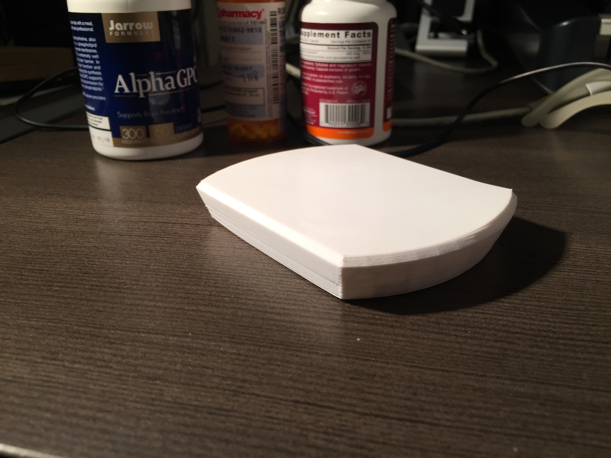
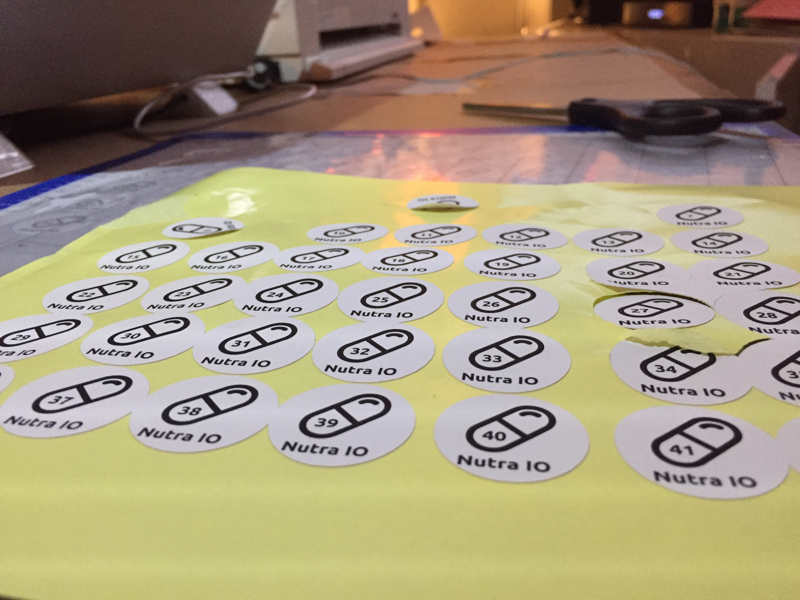
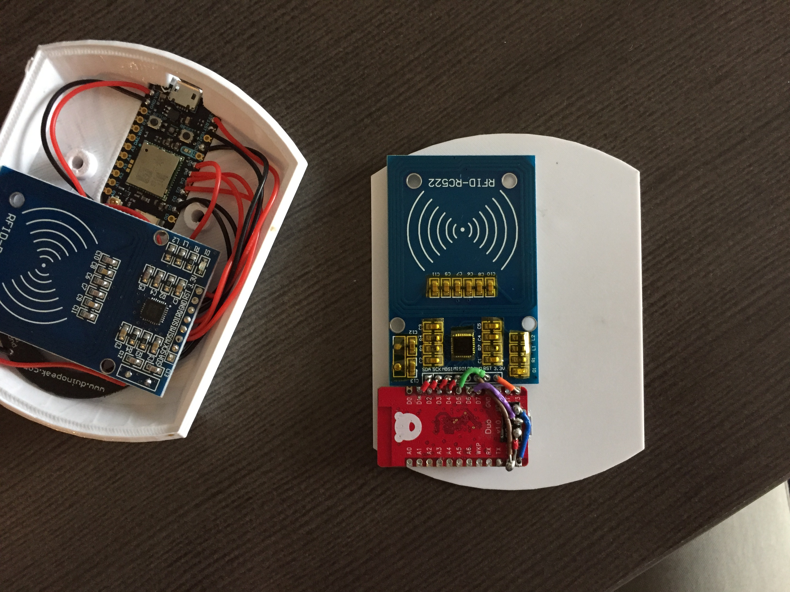

# Nutra.io Overview

## Introduction
Nutra.io is an innovative app designed to help people track their supplement and medication use and correlate these with their overall well-being. This approach aims to optimize health by integrating genetic data and expert knowledge.

## Key Features
- **Supplement and Medication Tracking:** Users can log their daily supplement and medication intake.
- **Well-being Correlation:** Track how supplements and medications impact overall health and specific symptoms.
- **Genetic Integration:** Utilize genetic information from sources like 23andMe to tailor supplement recommendations.
- **Knowledge Database:** Incorporate data from Examine.com to provide evidence-based insights into supplement use.
- **Auto-Reordering System:** Track individual usage of supplements and medications, automatically reordering when quantities reach a user-defined limit, such as five remaining.

## Future Plans
- **Enhanced Genetic Integration:** Broader analysis of genetic data to tailor supplementation further.
- **Expanded Database:** Continuous updates from sources like Examine.com to stay current with the latest supplement research.
- **New Features:** Upcoming features to improve user experience and provide more personalized health recommendations.

## New Feature Development

### Supplement Timing and Half-Life Information
- **Detailed Information:** Provide users with information about the optimal timing and half-life of each supplement to help them plan their intake effectively.
- **Timing Recommendations:** Tailor recommendations based on user goals, such as energy boost in the morning or cellular repair at night.

### User Check-In System
- **Real-Time Feedback:** Implement a system that prompts users to log how they feel at intervals after taking a supplement.
- **Data Collection:** Gather real-time feedback to understand the immediate and long-term effects of supplements on individual users.

### Personalized Feedback Loop
- **Adjust Recommendations:** Use collected data to adjust supplement recommendations based on individual responses.
- **Personal Insights:** Provide personalized insights to help users optimize their supplement intake for better health outcomes.

### Images

## Investor Information
Nutra.io is seeking investment to further develop and expand its platform. Key areas of focus for funding include:
- **Technology Development:** Enhancing the app's capabilities, including deeper genetic integration and more advanced tracking features.
- **Market Expansion:** Increasing reach and user base through strategic marketing and partnerships.
- **Research and Development:** Continuously updating the knowledge database with the latest research on supplements and genetic markers.
- **User Experience Improvements:** Investing in user interface and experience design to make the app more intuitive and effective.

Interested investors are invited to join us in revolutionizing personal health optimization through cutting-edge technology and personalized supplement tracking.
